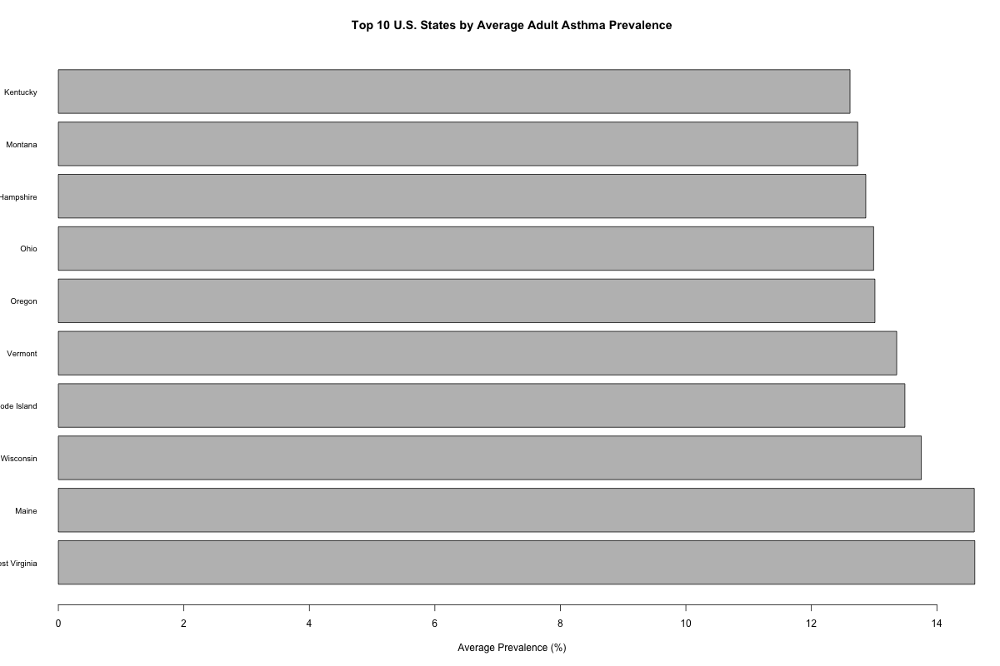
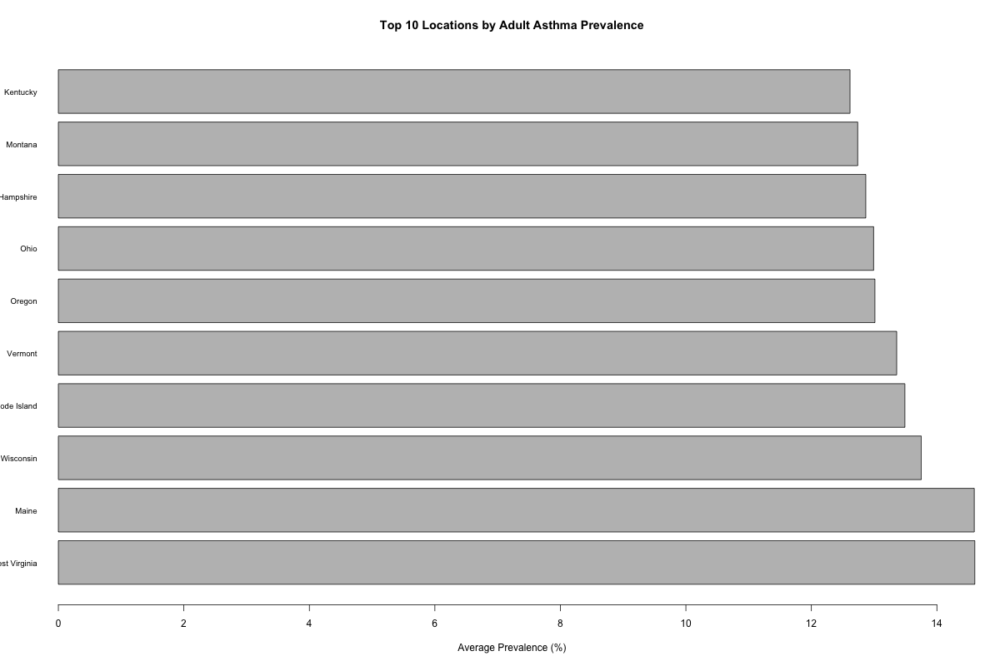
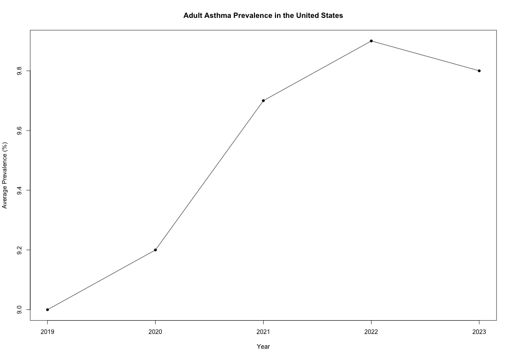
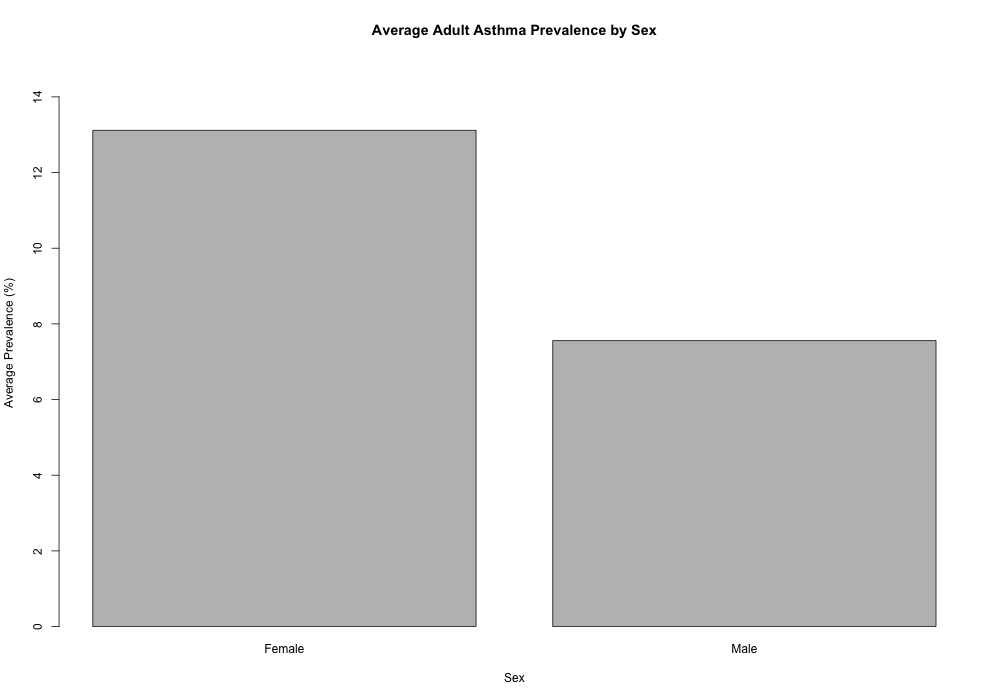
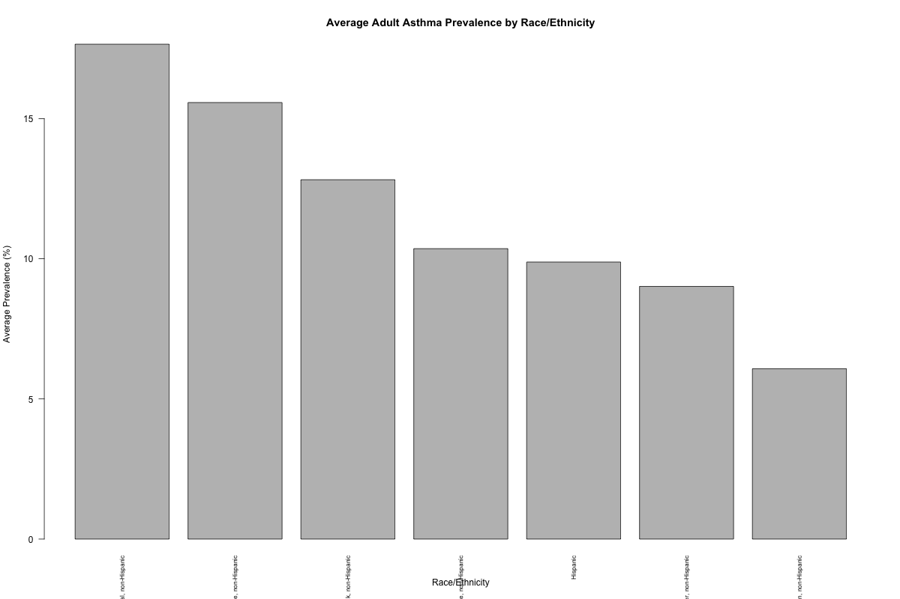
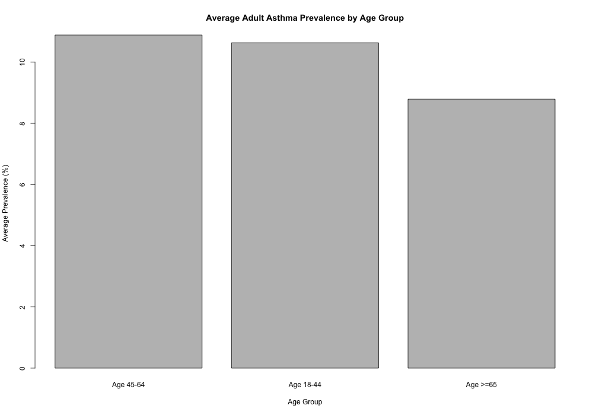

# Healthcare Data Analysis with R

## Project Overview

This project analyzes adult asthma prevalence data using R to identify patterns across U.S. states, time periods, sex, race/ethnicity, and age groups.

The project demonstrates an end-to-end healthcare data analytics workflow, including data cleaning, transformation, descriptive analysis, aggregation, and visualization.

The goal is to transform healthcare data into clear, meaningful insights that can support data-driven decision-making.

---

## Healthcare Question

**How does adult asthma prevalence vary across geographic locations and demographic groups, and how does prevalence change over time?**

---

## Project Objectives

- Clean and prepare healthcare data for analysis
- Examine adult asthma prevalence across U.S. states
- Analyze asthma prevalence trends over time
- Compare prevalence by sex
- Compare prevalence by race/ethnicity
- Compare prevalence by age group
- Identify geographic and demographic patterns
- Create data visualizations to communicate findings
- Develop data-driven insights from healthcare data
- Demonstrate a reproducible R analytics workflow

---

## Dataset

The analysis uses publicly available CDC healthcare data focused on **current asthma among adults**.

The dataset was analyzed to examine differences in asthma prevalence across geographic and demographic groups.

### Key Data Dimensions

- Geographic location
- Time period
- Sex
- Race/ethnicity
- Age group
- Asthma prevalence

---

## Tools & Technologies

- **R**
- **RStudio**
- **tidyverse**
- **dplyr**
- **ggplot2**
- **readr**
- **Data cleaning and transformation**
- **Exploratory data analysis (EDA)**
- **Descriptive statistics**
- **Data aggregation**
- **Data visualization**
- **CSV data processing**
- **GitHub**

---

## Analytical Workflow

The project follows a structured healthcare data analytics workflow:

1. **Data Import**
   - Imported healthcare data into R
   - Examined variables and data structure

2. **Data Cleaning**
   - Standardized variables
   - Prepared data for analysis
   - Removed unnecessary or unusable records

3. **Data Transformation**
   - Created analytical groupings
   - Aggregated data by geographic and demographic characteristics

4. **Exploratory Data Analysis**
   - Examined distributions and patterns
   - Compared asthma prevalence across groups

5. **Statistical Summaries**
   - Calculated summary measures
   - Created state-level and demographic summary datasets

6. **Visualization**
   - Developed charts using `ggplot2`
   - Created visualizations for geographic, demographic, and time-based comparisons

7. **Insight Development**
   - Identified notable patterns
   - Translated analytical results into healthcare-focused observations

---

## Key Visualizations

### Top 10 States by Asthma Prevalence



### Top 10 Geographic Locations



### U.S. Asthma Prevalence Trend



### Asthma Prevalence by Sex



### Asthma Prevalence by Race/Ethnicity



### Asthma Prevalence by Age



---

## Key Analytical Outputs

The project produces several summarized datasets that can be used for additional analysis and visualization.

### Summary Files

- `state_asthma_summary.csv`
- `asthma_trend_summary.csv`
- `asthma_sex_summary.csv`
- `asthma_race_summary.csv`
- `asthma_age_summary.csv`

These files provide structured analytical outputs organized by geographic, temporal, and demographic dimensions.

---

## R Scripts

### `analysis.R`

Primary analysis script containing the main analytical workflow, including data processing, analysis, and visualization.

### `analysis_clean.R`

Cleaned and organized version of the analytical workflow designed to improve readability and reproducibility.

### `healthcare-data-analysis.Rproj`

RStudio project file used to organize and manage the project environment.

---

## Project Structure

```text
healthcare-data-analysis/
│
├── figures/
│   ├── asthma_by_age.png
│   ├── asthma_by_race.png
│   ├── asthma_by_sex.png
│   ├── top_10_asthma_locations.png
│   ├── top_10_asthma_states.png
│   └── us_asthma_trend.png
│
├── analysis.R
├── analysis_clean.R
├── healthcare-data-analysis.Rproj
│
├── asthma_age_summary.csv
├── asthma_race_summary.csv
├── asthma_sex_summary.csv
├── asthma_trend_summary.csv
├── state_asthma_summary.csv
│
└── README.md
